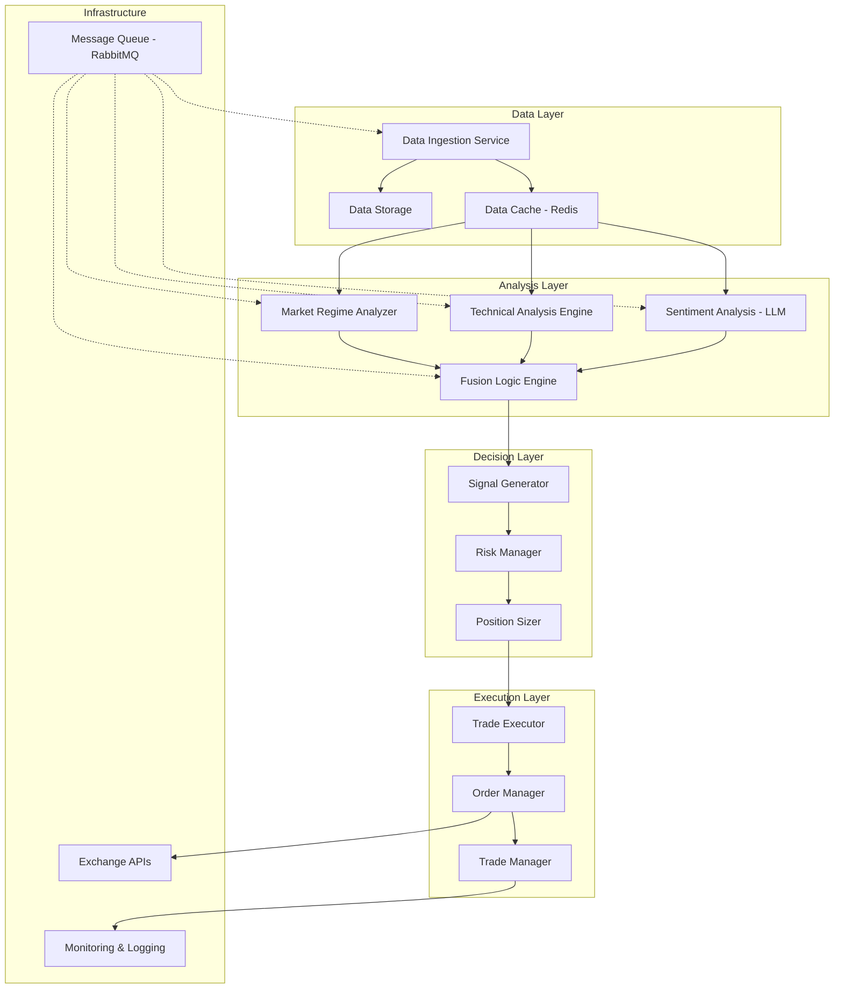

# AI Trading System Design Document

## Overview

The AI Trading System is a sophisticated, event-driven cryptocurrency trading platform built in Python that operates continuously (24/7). The system follows a microservices-inspired modular architecture with clear separation of concerns across seven distinct phases of operation. The design emphasizes real-time data processing, robust risk management, and seamless integration between technical analysis and AI-powered sentiment analysis.

### Key Design Principles

- **Event-Driven Architecture**: Asynchronous processing using message queues for scalability
- **Modular Design**: Clear separation between data ingestion, analysis, decision-making, and execution
- **Fault Tolerance**: Comprehensive error handling and automatic recovery mechanisms  
- **Real-Time Processing**: Sub-second response times for critical trading decisions
- **Extensibility**: Plugin-based architecture for adding new indicators, exchanges, and strategies

## Architecture

### High-Level System Architecture



### Technology Stack

- **Core Framework**: Python 3.11+ with asyncio for concurrent processing
- **Data Processing**: Pandas, NumPy for numerical computations
- **Technical Analysis**: TA-Lib, pandas-ta for indicators
- **Machine Learning**: Transformers library for LLM integration
- **Database**: PostgreSQL for persistent storage, Redis for caching
- **Message Queue**: RabbitMQ with aio-pika for async messaging
- **Exchange APIs**: CCXT library for unified exchange integration
- **Monitoring**: Prometheus + Grafana for metrics, structured logging with loguru
- **Configuration**: Pydantic for settings validation
- **Testing**: pytest with async support

## Components and Interfaces

### 1. Data Ingestion Service

**Purpose**: Continuously collect and normalize data from multiple sources

**Key Components**:
- `MarketDataCollector`: Real-time OHLCV data from exchanges
- `NewsCollector`: Headlines from crypto news APIs
- `SocialMediaCollector`: Twitter/X and Reddit sentiment data
- `DataNormalizer`: Standardizes data formats across sources

**Interfaces**:
```python
class DataCollector(ABC):
    @abstractmethod
    async def collect(self) -> AsyncGenerator[MarketData, None]:
        pass
    
    @abstractmethod
    async def health_check(self) -> bool:
        pass

class MarketData(BaseModel):
    symbol: str
    timestamp: datetime
    ohlcv: OHLCV
    volume: float
    source: str
```

### 2. Market Regime Analyzer

**Purpose**: Determine overall market conditions and set strategy mode

**Key Components**:
- `RegimeDetector`: Analyzes Bitcoin's price relative to 200-day SMA
- `StrategyModeManager`: Manages transitions between Bull/Bear/Range modes
- `RegimeSignalEmitter`: Broadcasts regime changes to other components

**Interfaces**:
```python
class RegimeAnalyzer:
    async def analyze_regime(self, btc_data: MarketData) -> MarketRegime
    async def get_current_strategy_mode(self) -> StrategyMode
    
class MarketRegime(Enum):
    BULL = "bull"
    BEAR = "bear" 
    RANGE = "range"

class StrategyMode(BaseModel):
    mode: MarketRegime
    confidence: float
    last_updated: datetime
```

### 3. Technical Analysis Engine

**Purpose**: Identify technical setups and generate trading signals

**Key Components**:
- `IndicatorCalculator`: Computes RSI, MACD, moving averages, etc.
- `PatternRecognizer`: Identifies candlestick patterns and chart formations
- `SetupScanner`: Scans for predefined long/short setups
- `SignalValidator`: Confirms technical setups with multiple indicators

**Interfaces**:
```python
class TechnicalAnalyzer:
    async def scan_setups(self, symbol: str) -> List[TechnicalSetup]
    async def validate_setup(self, setup: TechnicalSetup) -> ValidationResult

class TechnicalSetup(BaseModel):
    symbol: str
    setup_type: SetupType  # LONG_SUPPORT, SHORT_RESISTANCE, etc.
    confidence: float
    indicators: Dict[str, float]
    timeframe: str
```

### 4. Sentiment Analysis Module (LLM Integration)

**Purpose**: Analyze text data for sentiment and event detection

**Key Components**:
- `LLMProcessor`: Interfaces with language models for analysis
- `SentimentAnalyzer`: Determines positive/negative/neutral sentiment
- `EventDetector`: Identifies critical market events and catalysts
- `ContextManager`: Maintains relevant context for LLM queries

**Interfaces**:
```python
class SentimentAnalyzer:
    async def analyze_sentiment(self, symbol: str, timeframe: str) -> SentimentResult
    async def detect_events(self, symbol: str) -> List[MarketEvent]

class SentimentResult(BaseModel):
    symbol: str
    sentiment: Sentiment  # POSITIVE, NEGATIVE, NEUTRAL
    confidence: float
    key_factors: List[str]
    
class MarketEvent(BaseModel):
    symbol: str
    event_type: EventType  # HACK, REGULATION, UNLOCK, etc.
    severity: EventSeverity  # LOW, MEDIUM, HIGH, CRITICAL
    description: str
```

### 5. Fusion Logic Engine

**Purpose**: Combine technical and sentiment analysis for high-confidence signals

**Key Components**:
- `SignalFusion`: Combines TA and sentiment analysis
- `ConfidenceCalculator`: Computes overall signal confidence
- `SignalFilter`: Applies final filtering logic
- `SignalRanker`: Prioritizes multiple simultaneous signals

**Interfaces**:
```python
class FusionEngine:
    async def generate_signal(self, 
                            technical_setup: TechnicalSetup,
                            sentiment: SentimentResult,
                            events: List[MarketEvent]) -> Optional[TradingSignal]

class TradingSignal(BaseModel):
    symbol: str
    direction: TradeDirection  # LONG, SHORT
    confidence: float
    technical_score: float
    sentiment_score: float
    event_impact: float
    timestamp: datetime
```

### 6. Risk Management System

**Purpose**: Validate signals against risk parameters and portfolio constraints

**Key Components**:
- `RegimeValidator`: Ensures signals align with current strategy mode
- `ExposureManager`: Monitors portfolio concentration limits
- `VolatilityChecker`: Assesses asset volatility levels
- `RiskCalculator`: Computes position-specific risk metrics

**Interfaces**:
```python
class RiskManager:
    async def validate_signal(self, signal: TradingSignal) -> RiskValidationResult
    async def calculate_position_size(self, signal: TradingSignal) -> PositionSize

class RiskValidationResult(BaseModel):
    approved: bool
    rejection_reason: Optional[str]
    risk_score: float
    max_position_size: float
```

### 7. Trade Execution System

**Purpose**: Execute trades and manage positions through exchange APIs

**Key Components**:
- `OrderManager`: Places and manages exchange orders
- `PositionTracker`: Monitors open positions and P&L
- `TrailingStopManager`: Implements dynamic stop-loss adjustments
- `EmergencyExitHandler`: Handles immediate position closures

**Interfaces**:
```python
class TradeExecutor:
    async def execute_trade(self, trade_params: TradeParameters) -> ExecutionResult
    async def manage_position(self, position_id: str) -> None
    async def emergency_exit(self, position_id: str, reason: str) -> None

class TradeParameters(BaseModel):
    symbol: str
    direction: TradeDirection
    entry_price: float
    stop_loss: float
    take_profit_levels: List[float]
    position_size: float
```

## Data Models

### Core Data Structures

```python
class OHLCV(BaseModel):
    open: float
    high: float
    low: float
    close: float
    volume: float

class Position(BaseModel):
    id: str
    symbol: str
    direction: TradeDirection
    entry_price: float
    current_price: float
    quantity: float
    unrealized_pnl: float
    stop_loss: float
    take_profit_levels: List[float]
    status: PositionStatus
    created_at: datetime
    
class Trade(BaseModel):
    id: str
    position_id: str
    symbol: str
    direction: TradeDirection
    entry_price: float
    exit_price: Optional[float]
    quantity: float
    realized_pnl: Optional[float]
    entry_time: datetime
    exit_time: Optional[datetime]
    exit_reason: Optional[str]
    
class Portfolio(BaseModel):
    total_value: float
    available_balance: float
    positions: List[Position]
    daily_pnl: float
    total_pnl: float
    max_drawdown: float
```

### Configuration Models

```python
class TradingConfig(BaseModel):
    max_position_risk: float = 0.01  # 1% max loss per trade
    max_portfolio_exposure: float = 0.20  # 20% max per asset
    max_sector_exposure: float = 0.40  # 40% max per sector
    volatility_threshold: float = 0.05  # 5% max volatility
    
class ExchangeConfig(BaseModel):
    name: str
    api_key: str
    api_secret: str
    sandbox: bool = True
    rate_limit: int = 10  # requests per second
    
class LLMConfig(BaseModel):
    model_name: str = "gpt-4"
    max_tokens: int = 1000
    temperature: float = 0.1
    sentiment_prompt_template: str
    event_detection_prompt_template: str
```

## Error Handling

### Error Categories and Strategies

1. **Data Ingestion Errors**
   - Network timeouts: Exponential backoff retry (max 3 attempts)
   - API rate limits: Respect rate limits with queuing
   - Malformed data: Log and skip, continue processing

2. **Analysis Errors**
   - Insufficient data: Use fallback indicators or skip analysis
   - LLM API failures: Cache recent results, retry with backoff
   - Calculation errors: Log error, use default values

3. **Execution Errors**
   - Exchange API failures: Retry with exponential backoff
   - Insufficient balance: Reduce position size or skip trade
   - Order rejection: Log reason and adjust parameters

4. **System Errors**
   - Database connection loss: Implement connection pooling with retry
   - Message queue failures: Persist messages locally, replay on recovery
   - Memory/CPU exhaustion: Implement circuit breakers and graceful degradation

### Error Recovery Mechanisms

```python
class ErrorHandler:
    async def handle_data_error(self, error: DataError) -> RecoveryAction
    async def handle_execution_error(self, error: ExecutionError) -> RecoveryAction
    async def handle_system_error(self, error: SystemError) -> RecoveryAction

class CircuitBreaker:
    def __init__(self, failure_threshold: int = 5, timeout: int = 60):
        self.failure_threshold = failure_threshold
        self.timeout = timeout
        self.failure_count = 0
        self.last_failure_time = None
        self.state = CircuitState.CLOSED
```

## Testing Strategy

### Testing Pyramid

1. **Unit Tests** (70%)
   - Individual component logic
   - Data model validation
   - Calculation accuracy
   - Mock external dependencies

2. **Integration Tests** (20%)
   - Component interaction
   - Database operations
   - Message queue communication
   - Exchange API integration (sandbox)

3. **End-to-End Tests** (10%)
   - Complete trading workflows
   - System resilience testing
   - Performance benchmarks
   - Disaster recovery scenarios

### Testing Infrastructure

```python
# Example test structure
class TestTechnicalAnalyzer:
    @pytest.fixture
    async def analyzer(self):
        return TechnicalAnalyzer(config=test_config)
    
    async def test_rsi_calculation(self, analyzer):
        # Test RSI calculation accuracy
        pass
    
    async def test_setup_detection(self, analyzer):
        # Test setup identification
        pass

class TestTradeExecution:
    @pytest.fixture
    async def mock_exchange(self):
        return MockExchange()
    
    async def test_order_placement(self, mock_exchange):
        # Test order placement logic
        pass
```

### Performance Testing

- **Latency Requirements**: Sub-100ms for signal generation, sub-500ms for trade execution
- **Throughput Testing**: Handle 1000+ price updates per second
- **Memory Usage**: Monitor for memory leaks in long-running processes
- **Stress Testing**: Simulate high-volatility market conditions

## Monitoring and Observability

### Metrics Collection

```python
# Key performance indicators
class TradingMetrics:
    signal_generation_latency: Histogram
    trade_execution_latency: Histogram
    win_rate: Gauge
    daily_pnl: Gauge
    max_drawdown: Gauge
    active_positions: Gauge
    api_error_rate: Counter
    system_uptime: Gauge
```

### Logging Strategy

- **Structured Logging**: JSON format with correlation IDs
- **Log Levels**: DEBUG for development, INFO for production events, ERROR for failures
- **Sensitive Data**: Mask API keys and personal information
- **Retention**: 30 days for DEBUG, 90 days for INFO/ERROR

### Alerting Rules

- **Critical**: System downtime, exchange connectivity loss, significant losses
- **Warning**: High error rates, approaching risk limits, performance degradation
- **Info**: Strategy mode changes, large position entries/exits

This design provides a robust, scalable foundation for the AI trading system while maintaining the flexibility to adapt to changing market conditions and requirements.