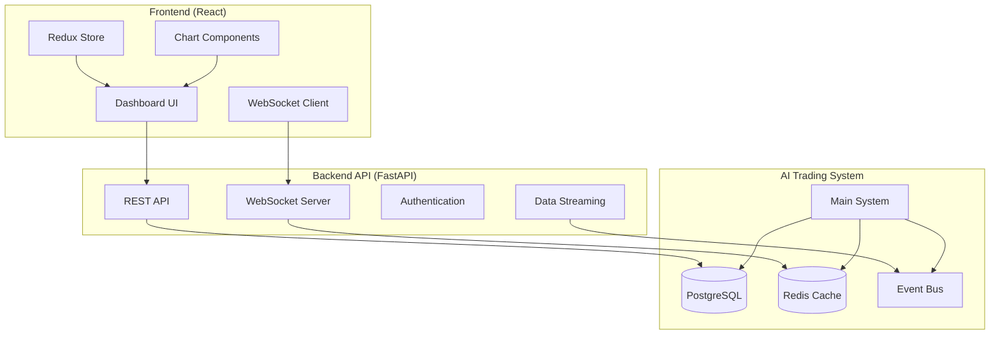

# Trading Dashboard Design Document

## Overview

The Trading Dashboard is a modern, real-time web application built with React and TypeScript that provides comprehensive monitoring and control capabilities for the AI Trading System. The dashboard features a responsive design with real-time data streaming, interactive charts, and intuitive user interface for monitoring trading operations, system performance, and AI decision-making processes.

### Key Design Principles

- **Real-Time First**: All data updates in real-time using WebSocket connections
- **Mobile Responsive**: Optimized for desktop, tablet, and mobile devices
- **Performance Focused**: Efficient data handling and smooth 60fps animations
- **User-Centric Design**: Intuitive interface that prioritizes critical information
- **Extensible Architecture**: Modular design for easy feature additions

## Architecture

### High-Level System Architecture



### Technology Stack

**Frontend:**

- **Framework**: React 18 with TypeScript
- **State Management**: Redux Toolkit with RTK Query
- **Styling**: Tailwind CSS with Headless UI components
- **Charts**: TradingView Charting Library + Chart.js
- **Real-time**: Socket.IO client for WebSocket connections
- **Build Tool**: Vite for fast development and building

**Backend API:**

- **Framework**: FastAPI with Python 3.11+
- **WebSockets**: FastAPI WebSocket support with Socket.IO
- **Database**: PostgreSQL with async SQLAlchemy
- **Cache**: Redis for real-time data caching
- **Authentication**: JWT tokens with refresh mechanism
- **API Documentation**: Auto-generated OpenAPI/Swagger docs

**Infrastructure:**

- **Deployment**: Docker containers with docker-compose
- **Reverse Proxy**: Nginx for serving static files and API routing
- **Process Management**: PM2 for Node.js processes
- **Monitoring**: Health checks and performance metrics

## Components and Interfaces

### 1. Dashboard Layout System

**Purpose**: Responsive layout with customizable panels and real-time updates

**Key Components**:

- `DashboardLayout`: Main layout container with sidebar and content area
- `PanelGrid`: Draggable and resizable panel system
- `StatusBar`: System status and connection indicators
- `NavigationSidebar`: Main navigation with active indicators

**Interfaces**:

```typescript
interface DashboardLayout {
  panels: PanelConfig[];
  layout: GridLayout;
  theme: "light" | "dark";
  sidebarCollapsed: boolean;
}

interface PanelConfig {
  id: string;
  type: PanelType;
  title: string;
  position: GridPosition;
  size: PanelSize;
  visible: boolean;
  settings: PanelSettings;
}
```

### 2. Real-Time Data Management

**Purpose**: Efficient real-time data streaming and state management

**Key Components**:

- `WebSocketManager`: Handles all WebSocket connections and reconnection
- `DataStreamProvider`: React context for real-time data distribution
- `CacheManager`: Client-side caching with automatic invalidation
- `EventBus`: Internal event system for component communication

**Interfaces**:

```typescript
interface WebSocketMessage {
  type: MessageType;
  channel: string;
  data: any;
  timestamp: number;
  id: string;
}

interface DataStream {
  subscribe(channel: string, callback: (data: any) => void): void;
  unsubscribe(channel: string, callback: (data: any) => void): void;
  send(message: WebSocketMessage): void;
}
```

### 3. Trading Activity Components

**Purpose**: Display live trading activities and order management

**Key Components**:

- `TradingFeed`: Real-time activity feed with filtering and search
- `OrderBook`: Live order book display with depth visualization
- `PositionManager`: Current positions with P&L and management controls
- `TradeHistory`: Historical trades with detailed analytics

**Interfaces**:

```typescript
interface TradingActivity {
  id: string;
  type: ActivityType;
  symbol: string;
  timestamp: Date;
  data: TradeData | OrderData | SignalData;
  status: ActivityStatus;
}

interface Position {
  id: string;
  symbol: string;
  direction: "LONG" | "SHORT";
  entryPrice: number;
  currentPrice: number;
  quantity: number;
  unrealizedPnL: number;
  realizedPnL: number;
  stopLoss: number;
  takeProfitLevels: number[];
  status: PositionStatus;
}
```

### 4. Interactive Chart System

**Purpose**: Advanced charting with technical indicators and trading signals

**Key Components**:

- `TradingViewChart`: Integration with TradingView charting library
- `IndicatorOverlay`: Technical indicators with customizable parameters
- `SignalMarkers`: Visual markers for entry/exit points and patterns
- `ChartControls`: Timeframe selection, indicator toggles, and drawing tools

**Interfaces**:

```typescript
interface ChartConfig {
  symbol: string;
  timeframe: Timeframe;
  indicators: IndicatorConfig[];
  overlays: OverlayConfig[];
  theme: ChartTheme;
  autoScale: boolean;
}

interface TechnicalIndicator {
  type: IndicatorType;
  parameters: IndicatorParams;
  visible: boolean;
  color: string;
  style: LineStyle;
}
```

### 5. AI Decision Analytics

**Purpose**: Visualize AI decision-making process and reasoning

**Key Components**:

- `SentimentAnalyzer`: Real-time sentiment analysis display
- `SignalFusion`: Visual representation of signal combination logic
- `RegimeIndicator`: Market regime analysis with confidence meters
- `DecisionTree`: Interactive decision flow visualization

**Interfaces**:

```typescript
interface AIDecision {
  id: string;
  timestamp: Date;
  type: DecisionType;
  symbol: string;
  confidence: number;
  reasoning: DecisionReasoning;
  factors: DecisionFactor[];
  outcome: DecisionOutcome;
}

interface SentimentAnalysis {
  symbol: string;
  sentiment: "POSITIVE" | "NEGATIVE" | "NEUTRAL";
  confidence: number;
  keyFactors: string[];
  newsImpact: number;
  socialImpact: number;
  processingTime: number;
}
```

### 6. Performance Analytics Dashboard

**Purpose**: Comprehensive performance metrics and reporting

**Key Components**:

- `PerformanceMetrics`: Key performance indicators with trend analysis
- `PnLChart`: Interactive P&L charts with time-based filtering
- `RiskMetrics`: Risk analysis with drawdown and volatility metrics
- `TradeAnalytics`: Detailed trade analysis with success factors

**Interfaces**:

```typescript
interface PerformanceMetrics {
  totalReturn: number;
  dailyPnL: number;
  winRate: number;
  sharpeRatio: number;
  maxDrawdown: number;
  volatility: number;
  totalTrades: number;
  avgTradeReturn: number;
}

interface PnLData {
  timestamp: Date;
  realizedPnL: number;
  unrealizedPnL: number;
  totalPnL: number;
  portfolioValue: number;
  drawdown: number;
}
```

## Data Models

### Core Data Structures

```typescript
// Portfolio and Trading
interface Portfolio {
  totalValue: number;
  availableBalance: number;
  positions: Position[];
  dailyPnL: number;
  totalPnL: number;
  maxDrawdown: number;
  lastUpdated: Date;
}

interface Trade {
  id: string;
  positionId: string;
  symbol: string;
  direction: TradeDirection;
  entryPrice: number;
  exitPrice: number;
  quantity: number;
  entryTime: Date;
  exitTime: Date;
  realizedPnL: number;
  fees: number;
  exitReason: string;
  setupType: string;
}

// System Status
interface SystemStatus {
  status: "RUNNING" | "STOPPED" | "ERROR" | "STARTING";
  uptime: number;
  lastHeartbeat: Date;
  activeConnections: number;
  processingSymbol?: string;
  currentPhase: TradingPhase;
  errors: SystemError[];
}

// Market Data
interface MarketData {
  symbol: string;
  price: number;
  change24h: number;
  volume24h: number;
  high24h: number;
  low24h: number;
  timestamp: Date;
}
```

### Configuration Models

```typescript
interface DashboardConfig {
  theme: "light" | "dark" | "auto";
  layout: LayoutConfig;
  notifications: NotificationConfig;
  charts: ChartConfig;
  trading: TradingConfig;
}

interface NotificationConfig {
  enabled: boolean;
  types: NotificationType[];
  sound: boolean;
  desktop: boolean;
  email: boolean;
}

interface TradingConfig {
  autoTrading: boolean;
  maxPositions: number;
  riskPerTrade: number;
  emergencyStop: boolean;
  allowedSymbols: string[];
}
```

## API Design

### REST API Endpoints

```typescript
// Authentication
POST /api/auth/login
POST /api/auth/refresh
POST /api/auth/logout

// System Management
GET /api/system/status
POST /api/system/start
POST /api/system/stop
GET /api/system/health

// Trading Data
GET /api/portfolio
GET /api/positions
GET /api/trades?limit=100&offset=0
GET /api/orders?status=active

// Market Data
GET /api/market/{symbol}/price
GET /api/market/{symbol}/history?timeframe=1h&limit=1000
GET /api/market/watchlist

// Analytics
GET /api/analytics/performance?period=30d
GET /api/analytics/trades/summary
GET /api/analytics/ai-decisions?limit=50

// Configuration
GET /api/config/dashboard
PUT /api/config/dashboard
GET /api/config/trading
PUT /api/config/trading
```

### WebSocket Events

```typescript
// Real-time Data Streams
'market_data' -> MarketData
'portfolio_update' -> Portfolio
'position_update' -> Position
'trade_executed' -> Trade
'order_update' -> Order

// System Events
'system_status' -> SystemStatus
'ai_decision' -> AIDecision
'signal_generated' -> TradingSignal
'regime_change' -> MarketRegime

// User Actions
'emergency_stop' -> EmergencyStopResult
'position_close' -> PositionCloseResult
'config_update' -> ConfigUpdateResult
```

## User Interface Design

### Dashboard Layout

```
┌─────────────────────────────────────────────────────────────┐
│ Header: Logo | System Status | Portfolio Value | Controls   │
├─────────────────────────────────────────────────────────────┤
│ Sidebar │ Main Content Area                                 │
│         │ ┌─────────────────┬─────────────────────────────┐ │
│ • Home  │ │ Price Charts    │ Trading Activity Feed       │ │
│ • Trade │ │                 │                             │ │
│ • P&L   │ │                 │ • Signal Generated          │ │
│ • AI    │ │                 │ • Order Placed              │ │
│ • Config│ │                 │ • Position Opened           │ │
│         │ └─────────────────┴─────────────────────────────┘ │
│         │ ┌─────────────────┬─────────────────────────────┐ │
│         │ │ Open Positions  │ AI Decision Analytics       │ │
│         │ │                 │                             │ │
│         │ │ BTC/USDT LONG   │ Sentiment: POSITIVE (0.8)   │ │
│         │ │ +$245.50        │ Technical: BULLISH (0.7)    │ │
│         │ │                 │ Fusion: HIGH CONF (0.75)    │ │
│         │ └─────────────────┴─────────────────────────────┘ │
└─────────────────────────────────────────────────────────────┘
```

### Mobile Layout

```
┌─────────────────────┐
│ ☰ AI Trading | $$$  │
├─────────────────────┤
│ 📊 BTC/USDT Chart   │
│                     │
│ ▲ $43,250 (+2.1%)   │
├─────────────────────┤
│ 🔄 Recent Activity  │
│ • Signal: BTC LONG  │
│ • Order: Filled     │
│ • P&L: +$125.50     │
├─────────────────────┤
│ 💼 Positions (2)    │
│ BTC/USDT +$245      │
│ ETH/USDT -$45       │
└─────────────────────┘
```

## Performance Considerations

### Frontend Optimization

- **Virtual Scrolling**: For large trade history and activity feeds
- **Memoization**: React.memo and useMemo for expensive calculations
- **Code Splitting**: Lazy loading of dashboard panels and routes
- **WebSocket Throttling**: Limit update frequency to 60fps for smooth UI
- **Chart Optimization**: Efficient data structures for real-time chart updates

### Backend Optimization

- **Connection Pooling**: Efficient database connection management
- **Redis Caching**: Cache frequently accessed data with appropriate TTL
- **WebSocket Scaling**: Support for multiple concurrent connections
- **Data Compression**: Compress WebSocket messages for faster transmission
- **Rate Limiting**: Prevent API abuse and ensure fair resource usage

## Security Considerations

### Authentication & Authorization

- **JWT Tokens**: Secure authentication with refresh token rotation
- **Role-Based Access**: Different permission levels for different users
- **Session Management**: Automatic logout on inactivity
- **API Rate Limiting**: Prevent abuse and ensure system stability

### Data Protection

- **Input Validation**: Sanitize all user inputs and API parameters
- **SQL Injection Prevention**: Use parameterized queries and ORM
- **XSS Protection**: Content Security Policy and input sanitization
- **HTTPS Only**: All communications encrypted with TLS 1.3
- **Sensitive Data Masking**: Hide API keys and sensitive information in logs

## Testing Strategy

### Frontend Testing

- **Unit Tests**: Jest and React Testing Library for component testing
- **Integration Tests**: Test WebSocket connections and API integrations
- **E2E Tests**: Playwright for full user workflow testing
- **Visual Regression**: Screenshot testing for UI consistency
- **Performance Tests**: Lighthouse audits and bundle size monitoring

### Backend Testing

- **API Tests**: FastAPI test client for endpoint testing
- **WebSocket Tests**: Test real-time data streaming functionality
- **Load Tests**: Simulate multiple concurrent users and connections
- **Database Tests**: Test data integrity and query performance
- **Security Tests**: Vulnerability scanning and penetration testing

This design provides a comprehensive, scalable foundation for the trading dashboard while ensuring excellent user experience and system performance.
